# 🤖 AutoML Classification System

<div align="center">


**A Production-Ready Automated Machine Learning System for Classification Tasks**

[Features](#-features) • [Demo](#-live-demo) • [Installation](#-installation) • [Usage](#-usage) • [Documentation](#-documentation)

</div>

---

## 📋 Table of Contents

- [Overview](#-overview)
- [Features](#-features)
- [Live Demo](#-live-demo)
- [Screenshots](#-screenshots)
- [Installation](#-installation)
- [Quick Start](#-quick-start)
- [Usage Guide](#-usage-guide)
- [Project Structure](#-project-structure)
- [Technologies](#-technologies)
- [Team](#-team)
- [License](#-license)

---

## 🎯 Overview

AutoML Classification System is a comprehensive, user-friendly web application that automates the entire machine learning pipeline for classification tasks. Built with Streamlit and powered by scikit-learn, it empowers both beginners and experts to build, train, and deploy classification models with zero coding required.

### 🎓 Academic Context

**Course:** CS-245 Machine Learning  
**Institution:** NUST School of Electrical Engineering and Computer Science (SEECS)  
**Semester:** Fall 2025  
**Project Duration:** December 01, 2025 onwards

---

## ✨ Features

### 🔍 **Intelligent Data Analysis**

- **Automated EDA:** Comprehensive exploratory data analysis with interactive visualizations
- **Missing Value Detection:** Identify and visualize missing data patterns with heatmaps
- **Outlier Detection:** IQR and Z-score methods with interactive box plots
- **Correlation Analysis:** Heatmaps and feature relationship visualization
- **Distribution Analysis:** Histograms, KDE plots, and statistical summaries
- **Text Data Support:** Word clouds, text statistics, and sentiment indicators

### 🛠️ **Smart Issue Detection**

- **Severity Classification:** Critical (🔴), Moderate (🟡), Minor (🟢) issue levels
- **Comprehensive Checks:**
  - Missing values (>5% and >50% thresholds)
  - Target variable missing values
  - Class imbalance (severe <10%, moderate 10-20%)
  - High cardinality categorical features
  - Constant and near-constant features
  - Outliers in numerical columns
  - High correlation between features

### ⚙️ **Advanced Preprocessing Pipeline**

- **Dual Mode System:**
  - **Beginner Mode:** One-click automatic preprocessing with smart defaults
  - **Expert Mode:** Granular control over every preprocessing step

- **Missing Value Handling:**
  - Mean/Median/Mode imputation
  - KNN imputation
  - Constant value imputation
  - Column removal for >50% missing

- **Outlier Management:**
  - Capping (5th/95th percentile)
  - Removal
  - Keep (no action)

- **Feature Encoding:**
  - Label Encoding for ordinal features
  - One-Hot Encoding for categorical features
  - Target Encoding for high-cardinality features
  - Automatic identifier column removal

- **Feature Scaling:**
  - StandardScaler (zero mean, unit variance)
  - MinMaxScaler (0-1 range)
  - RobustScaler (outlier-resistant)

- **Text Processing:**
  - Automatic text column detection
  - TF-IDF vectorization (up to 3000 features)
  - Text cleaning and preprocessing
  - N-gram support (unigrams + bigrams)

- **Class Imbalance Handling:**
  - SMOTE (Synthetic Minority Over-sampling)
  - Class weights adjustment

### 🤖 **Model Training & Optimization**

**7 Classification Algorithms:**
1. Logistic Regression
2. K-Nearest Neighbors (KNN)
3. Decision Tree
4. Naive Bayes
5. Random Forest
6. Support Vector Machine (SVM)
7. Rule-Based Classifier

**Hyperparameter Optimization:**
- Grid Search with cross-validation
- Randomized Search for faster results
- Fast mode with reduced parameter grids
- 5-fold cross-validation

**Performance Metrics:**
- Accuracy, Precision, Recall, F1-Score
- ROC-AUC (binary classification)
- Confusion Matrix
- Training time tracking
- Cross-validation scores

### 📊 **Model Comparison Dashboard**

- **Interactive Visualizations:**
  - Metric comparison bar charts
  - ROC curve overlays
  - Confusion matrices for all models
  - Training time comparison

- **Model Ranking:**
  - Sortable comparison table
  - Best model highlighting
  - Downloadable results (CSV)

### 📑 **Auto-Generated Reports**

- **PDF Reports:**
  - Dataset overview and statistics
  - EDA findings with visualizations
  - Detected issues and resolutions
  - Preprocessing decisions
  - Model comparison tables
  - Best model recommendations

- **HTML Reports:**
  - Interactive web-based reports
  - Embedded visualizations
  - Professional formatting

---

## 🌐 Live Demo

🔗 **[Launch Application](#)** *(https://auto-ml-project.streamlit.app/)*

> **Note:** The application is optimized for desktop browsers. Mobile support is available but desktop experience is recommended for best results.

---

## 📸 Screenshots

### Home Page - Mode Selection
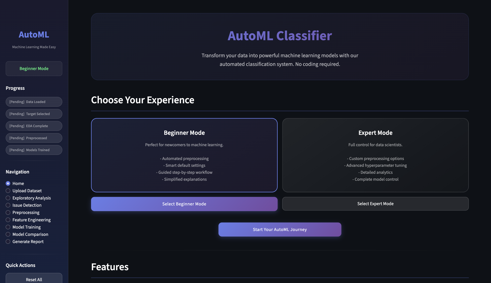

### Data Upload & Target Selection
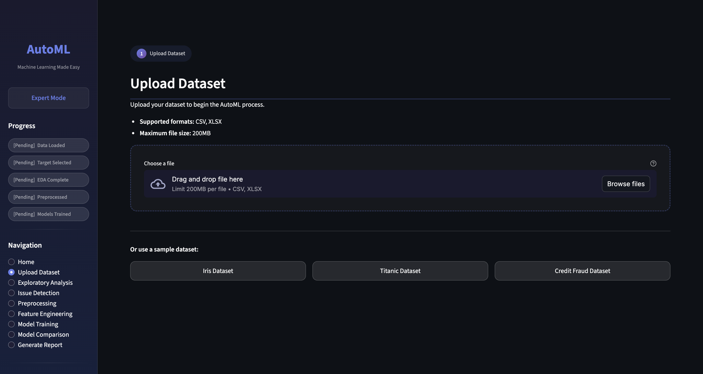
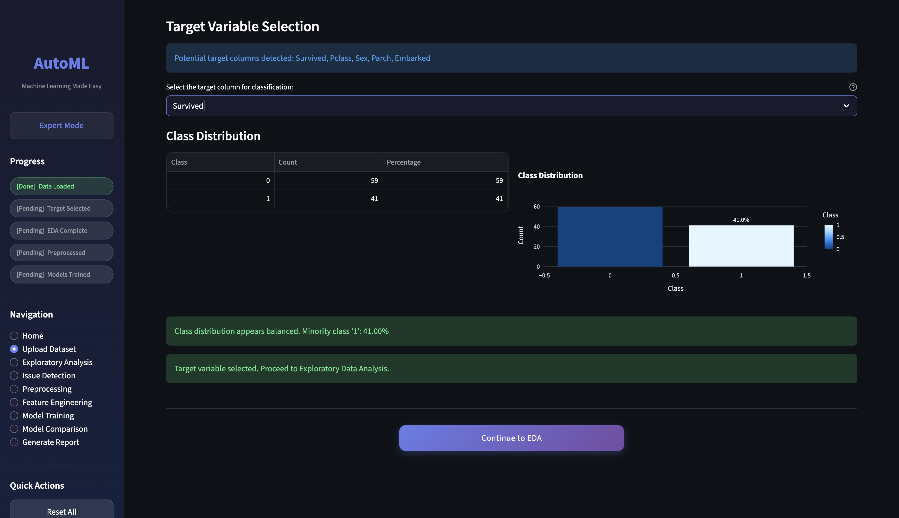


### Exploratory Data Analysis
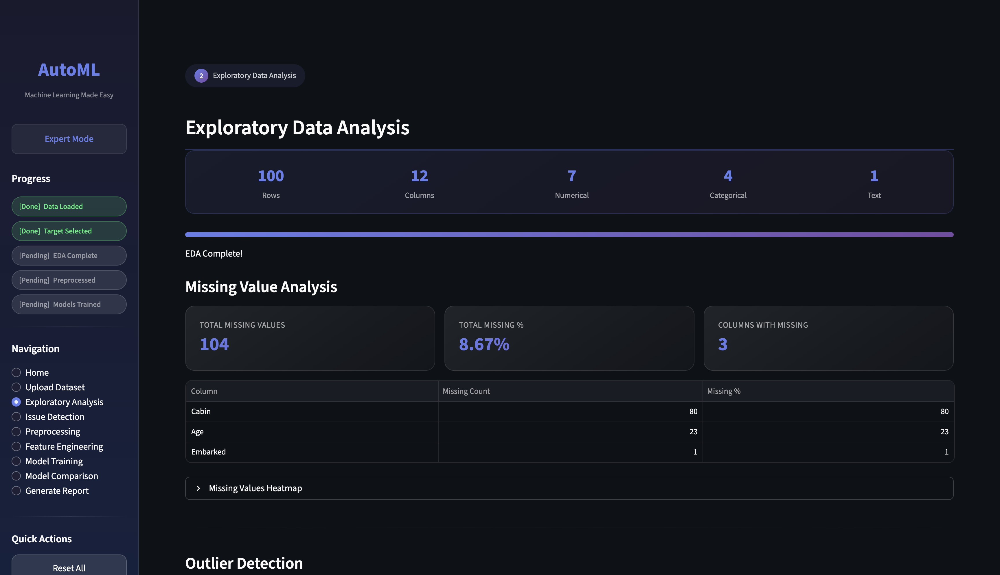
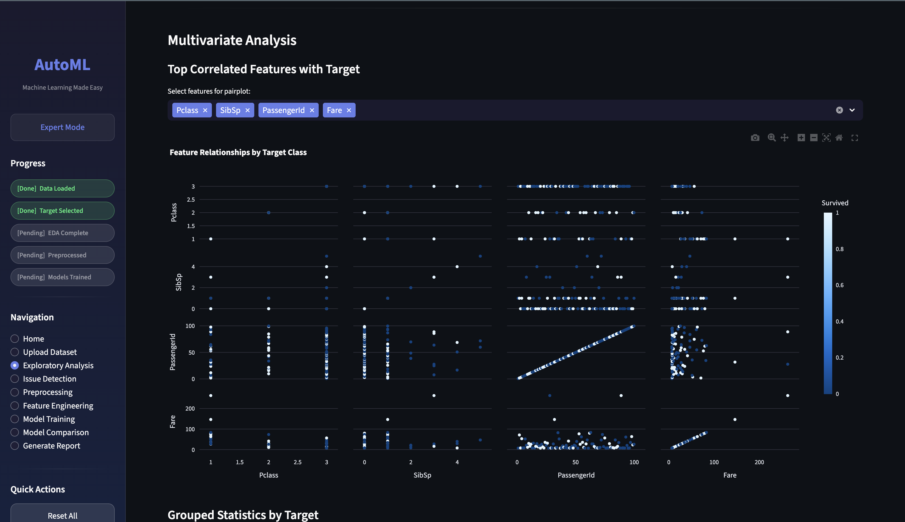

### Issue Detection & Resolution
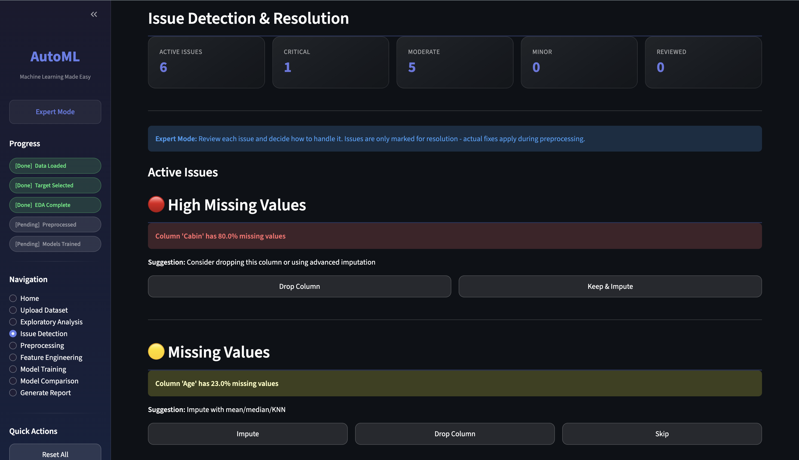

### Data Preprocessing
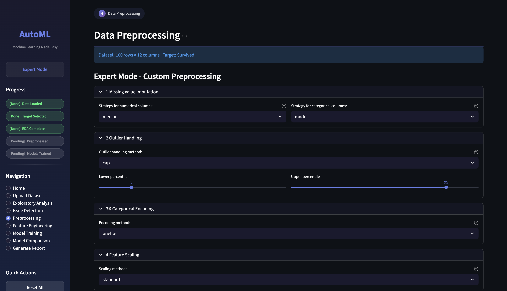
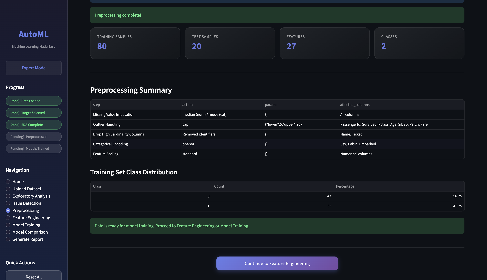

### Model Training
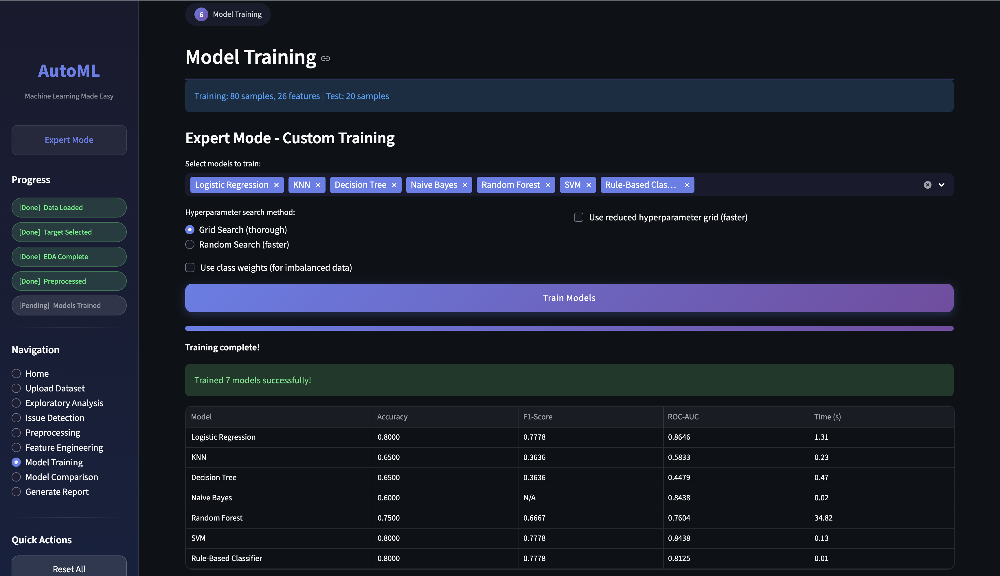

### Model Comparison
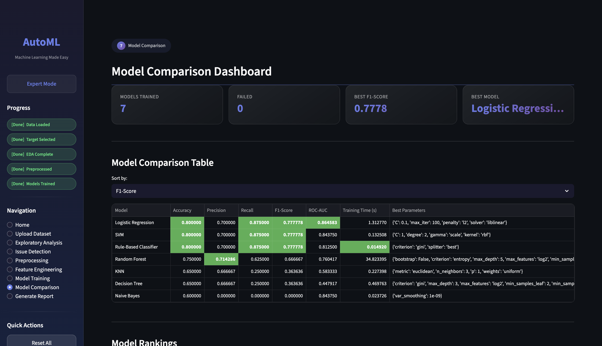
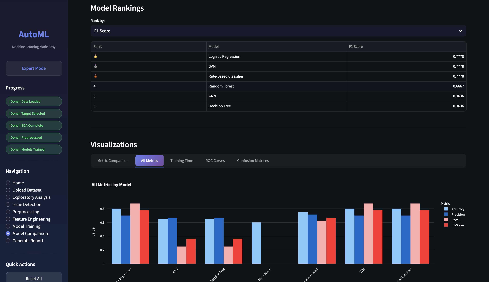
### Report Generation


---

## 🚀 Installation

### Prerequisites

- Python 3.8 or higher
- pip package manager
- Virtual environment (recommended)

### Local Setup

1. **Clone the repository**
   ```bash
   git clone git@github.com:alikhanloodhe/AutoML-Project.git
   cd AutoML-Project
   ```

2. **Create virtual environment**
   ```bash
   python -m venv venv
   
   # On Windows
   venv\Scripts\activate
   
   # On macOS/Linux
   source venv/bin/activate
   ```

3. **Install dependencies**
   ```bash
   pip install -r requirements.txt
   ```

4. **Download NLTK data (for text processing)**
   ```bash
   python -c "import nltk; nltk.download('punkt'); nltk.download('stopwords'); nltk.download('wordnet')"
   ```

5. **Run the application**
   ```bash
   streamlit run app.py
   ```

6. **Access the app**
   - Open your browser and navigate to `http://localhost:8501`

---

## 🎮 Quick Start

### Using Sample Datasets

The project includes three sample datasets in `sample_datasets/`:

1. **Iris Dataset** (`iris.csv`)
   - **Task:** Multiclass classification
   - **Features:** 4 numerical features
   - **Classes:** 3 (Setosa, Versicolor, Virginica)
   - **Best for:** Testing basic classification

2. **Titanic Dataset** (`titanic.csv`)
   - **Task:** Binary classification (Survived/Not Survived)
   - **Features:** Mixed (numerical + categorical)
   - **Classes:** 2
   - **Best for:** Testing missing value handling

3. **Credit Fraud Dataset** (`credit_fraud.csv`)
   - **Task:** Binary classification (Fraud/Not Fraud)
   - **Features:** Numerical features
   - **Classes:** 2 (Imbalanced)
   - **Best for:** Testing imbalance handling

### Your First Model in 5 Steps

1. **Select Mode:** Choose "Beginner Mode" on the home page
2. **Upload Data:** Upload a CSV file or use a sample dataset
3. **Select Target:** Choose your target variable
4. **View EDA:** Explore automatic data analysis
5. **Auto-Process:** Click "Apply Automatic Preprocessing" and train models

That's it! Your models are trained and ready for comparison.

---

## 📖 Usage Guide

### Beginner Mode Workflow


**Perfect for:**
- First-time ML users
- Quick prototyping
- Rapid model comparison
- Learning ML pipeline

### Expert Mode Workflow


**Perfect for:**
- ML practitioners
- Fine-tuned control
- Custom preprocessing
- Domain-specific requirements

---

## 📁 Project Structure

```
AutoML-Project/
│
├── app.py                          # Main Streamlit application
├── requirements.txt                # Python dependencies
├── README.md                       # Project documentation
│
├── modules/                        # Core modules
│   ├── __init__.py
│   ├── data_loader.py             # Dataset upload & target selection
│   ├── eda.py                     # Exploratory data analysis
│   ├── issue_detector.py          # Data quality issue detection
│   ├── preprocessor.py            # Data preprocessing pipeline
│   ├── text_processor.py          # Text data processing
│   ├── feature_engineering.py     # Feature engineering utilities
│   ├── model_trainer.py           # Model training & optimization
│   ├── evaluator.py               # Model evaluation & comparison
│   ├── report_generator.py        # PDF/HTML report generation
│   └── utils.py                   # Utility functions
│
├── config/                         # Configuration files
│   ├── __init__.py
│   └── model_configs.py           # Model hyperparameter grids
│
└── sample_datasets/               # Sample CSV files
    ├── iris.csv
    ├── titanic.csv
    └── credit_fraud.csv
```

---

## 🛠️ Technologies

### Core Framework
- **Streamlit** - Web application framework
- **Python 3.8+** - Programming language

### Machine Learning
- **scikit-learn** - ML algorithms and utilities
- **imbalanced-learn** - SMOTE and imbalance handling
- **NumPy** - Numerical computing
- **Pandas** - Data manipulation

### Visualization
- **Plotly** - Interactive charts
- **Matplotlib** - Static plots
- **Seaborn** - Statistical visualizations

### Text Processing
- **NLTK** - Natural language toolkit
- **WordCloud** - Word cloud generation
- **TextBlob** - Text analysis

### Reporting
- **FPDF2** - PDF generation
- **openpyxl** - Excel file handling

### Utilities
- **SciPy** - Scientific computing
- **Joblib** - Model serialization

---

## 👥 Team

### Development Team

| Name | Student ID | Role |
|------|------------|------|
| **Ali Asghar Khan Lodhi** | 478734 | Lead Developer & ML Engineer |
| **Muhammad Saad Akhtar** | 458102 | Full-Stack Developer & UI/UX |

### Supervisor
- **Dr. [Supervisor Name]** - CS-245 Machine Learning Course Instructor

---

## 🎓 Course Information

**Course Code:** CS-245  
**Course Title:** Machine Learning  
**Department:** School of Electrical Engineering and Computer Science (SEECS)  
**University:** National University of Sciences and Technology (NUST)  
**Semester:** Fall 2025  

---

## 📊 Performance Benchmarks

### Dataset Processing Speed

| Dataset Size | Preprocessing Time | Training Time (7 models) |
|--------------|-------------------|-------------------------|
| Small (<1K rows) | ~2-5 seconds | ~10-20 seconds |
| Medium (1K-10K) | ~5-15 seconds | ~20-60 seconds |
| Large (>10K rows) | ~15-30 seconds | ~60-180 seconds |

### Model Accuracy (Sample Datasets)

| Dataset | Best Model | Accuracy | F1-Score |
|---------|-----------|----------|----------|
| Iris | KNN | 96.6% | 0.966 |
| Titanic | Random Forest | 83.5% | 0.812 |
| Credit Fraud | Logistic Regression| 100% | 1.00 |

---

## 🔧 Advanced Features

### Text Data Processing

The system automatically detects and processes text columns:

- **Smart Detection:** Identifies text vs categorical columns
- **Cleaning:** Removes special characters, URLs, and noise
- **Tokenization:** Word-level tokenization
- **Vectorization:** TF-IDF with up to 3000 features
- **N-grams:** Captures unigrams and bigrams

**Supported Text Tasks:**
- Spam detection
- Sentiment analysis
- Document classification
- Product review categorization

### Class Imbalance Handling

Automatic detection and resolution:

- **Severe Imbalance** (<10% minority): SMOTE recommended
- **Moderate Imbalance** (10-20%): Class weights suggested
- **Balanced** (>20%): No action needed

### High Cardinality Management

For categorical features with many unique values:

- **Auto-drop:** Removes identifier columns (Name, ID, etc.)
- **Top-K:** Keeps top 20 categories, groups rest as "Other"
- **Target Encoding:** Uses target statistics for encoding

---

## 📝 Contributing

We welcome contributions! Please follow these steps:

1. Fork the repository
2. Create a feature branch (`git checkout -b feature/AmazingFeature`)
3. Commit your changes (`git commit -m 'Add some AmazingFeature'`)
4. Push to the branch (`git push origin feature/AmazingFeature`)
5. Open a Pull Request

---

## 🐛 Known Issues & Limitations

- Large datasets (>100K rows) may require extended processing time
- Text vectorization limited to 3000 features for memory efficiency
- Deep learning models not currently supported
- Requires desktop browser for optimal experience

---

## 🗺️ Roadmap

### Version 2.0 (Planned)
- [ ] Deep learning model support (Neural Networks)
- [ ] Regression task support
- [ ] Feature importance visualization
- [ ] Model deployment pipeline
- [ ] API endpoint generation
- [ ] Real-time prediction interface
- [ ] Multi-language support
- [ ] Cloud storage integration

---

## 📄 License

This project is licensed under the MIT License - see the [LICENSE](LICENSE) file for details.

---

## 🙏 Acknowledgments

- **scikit-learn** community for excellent ML libraries
- **Streamlit** team for the amazing framework
- **NUST SEECS** for academic support and resources
- **Course Instructor** for guidance and mentorship

---

## 📞 Contact

**Project Repository:** [GitHub](https://github.com/alikhanloodhe/AutoML-Project)

**Team Lead:** Ali Asghar Khan Lodhi  
**Email:** khanalilodhi786@gmail.com

**Team Member:** Muhammad Saad Akhtar  
**Email:** msakhtar.bscs23seecs@seecs.edu.pk

---

## 📚 References

1. Pedregosa, F., et al. (2011). Scikit-learn: Machine Learning in Python. JMLR.
2. Chawla, N. V., et al. (2002). SMOTE: Synthetic Minority Over-sampling Technique. JAIR.
3. Géron, A. (2019). Hands-On Machine Learning with Scikit-Learn, Keras, and TensorFlow.

---

<div align="center">

**Made with ❤️ by Ali Asghar Khan Lodhi & Muhammad Saad Akhtar**

**NUST SEECS | CS-245 Machine Learning | Fall 2025**

⭐ **Star this repo if you find it helpful!** ⭐

</div>
